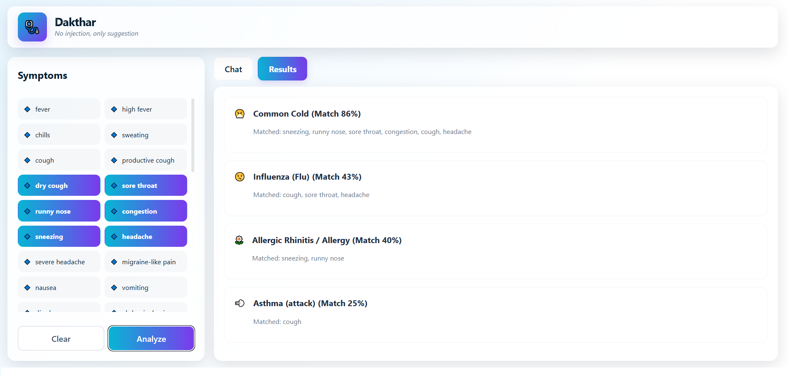

# 🩺 Dakthar
> **"No injection, only suggestion."**

Dakthar is a high-fidelity, React-based medical symptom assistant designed to provide educational insights into potential health conditions. Using a weighted matching algorithm, it analyzes user-selected symptoms and provides immediate suggestions and precautionary measures.

## ✨ Features
* **Real-time Analysis:** Instant feedback based on a library of common health conditions.
* **Weighted Matching:** Prioritizes "Red Flag" symptoms to alert users of emergencies.
* **Dual View Interface:** Toggle between a conversational **Chat** mode and a data-rich **Dashboard**.
* **Modern UI:** A full-screen, glassmorphism-inspired design.

## 🛠️ Built With
* **React (Vite)**
* **CSS3 (Custom Grid/Flexbox)**
* **GitHub Pages**

## 🚀 Getting Started
1. Clone & Install: `npm install`
2. Run locally: `npm run dev`
3. Deploy: `npm run deploy`